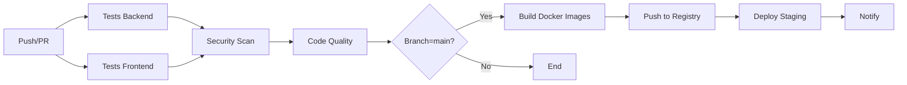

# 💇‍♀️ Depilaciones Debby - DevOps CI/CD Project

[](https://github.com/username/depilaciones-debby/actions)
[](https://codecov.io/gh/username/depilaciones-debby)
[](https://sonarcloud.io/dashboard?id=username_depilaciones-debby)

Proyecto DevOps completo con **CI/CD automatizado** para un microservicio de gestión de reservas de depilación. Este proyecto implementa todas las mejores prácticas de DevOps moderno: containerización, testing automatizado, análisis de seguridad, deployment continuo y orquestación de contenedores.

---

## 📋 Tabla de Contenidos

- [Arquitectura](#-arquitectura)
- [Tecnologías](#-tecnologías)
- [Estructura del Proyecto](#-estructura-del-proyecto)
- [Quick Start](#-quick-start)
- [CI/CD Pipeline](#-cicd-pipeline)
- [Seguridad](#-seguridad)
- [Orquestación](#-orquestación)
- [Trazabilidad y Calidad](#-trazabilidad-y-calidad)
- [Deployment](#-deployment)

---

## 🏗️ Arquitectura

```
┌─────────────────┐      ┌─────────────────┐      ┌─────────────────┐
│                 │      │                 │      │                 │
│   Frontend      │─────▶│   Backend API   │─────▶│    MongoDB      │
│   (React)       │      │   (Node.js)     │      │                 │
│                 │      │                 │      │                 │
└─────────────────┘      └─────────────────┘      └─────────────────┘
     Nginx:80                Express:5000             Mongo:27017
```

### Componentes principales:

- **Frontend**: React + Vite + React Router
- **Backend**: Node.js + Express + MongoDB
- **Base de datos**: MongoDB 7.0
- **Containerización**: Docker multi-stage builds
- **Orquestación**: Docker Compose + Kubernetes
- **CI/CD**: GitHub Actions
- **Seguridad**: Snyk + Dependabot + SonarCloud

---

## 🚀 Tecnologías

### Frontend
- **React** 19.1.1 - Framework UI
- **Vite** - Build tool y dev server
- **React Router** 7.9.4 - Routing
- **Vitest** - Testing framework

### Backend
- **Node.js** 18+ - Runtime
- **Express** 4.19 - Web framework
- **Mongoose** 8.5 - ODM para MongoDB
- **Jest** + **Supertest** - Testing
- **Express Validator** - Validaciones

### DevOps
- **Docker** - Containerización
- **Docker Compose** - Orquestación local
- **Kubernetes** - Orquestación producción
- **GitHub Actions** - CI/CD
- **Snyk** - Análisis de vulnerabilidades
- **SonarCloud** - Calidad de código
- **Dependabot** - Gestión de dependencias

---

## 📁 Estructura del Proyecto

```
depilaciones-debby/
├── .github/
│   ├── workflows/
│   │   └── ci-cd.yml           # Pipeline CI/CD completo
│   └── dependabot.yml          # Configuración Dependabot
├── BACKEND/
│   ├── src/
│   │   ├── config/             # Configuraciones
│   │   ├── controllers/        # Lógica de negocio
│   │   ├── models/             # Modelos de datos
│   │   ├── routes/             # Rutas API
│   │   ├── middleware/         # Middlewares
│   │   └── server.js           # Entry point
│   ├── __tests__/              # Tests unitarios
│   ├── Dockerfile              # Multi-stage build
│   ├── .dockerignore
│   ├── package.json
│   └── jest.config.js
├── FRONTEND/
│   └── depilaciones-debby/
│       ├── src/
│       │   ├── components/     # Componentes React
│       │   ├── pages/          # Páginas
│       │   ├── data/           # Datos estáticos
│       │   └── App.jsx
│       ├── Dockerfile          # Multi-stage build
│       ├── nginx.conf          # Configuración Nginx
│       └── package.json
├── k8s/                        # Manifiestos Kubernetes
│   ├── namespace.yaml
│   ├── configmap.yaml
│   ├── mongodb-deployment.yaml
│   ├── backend-deployment.yaml
│   ├── frontend-deployment.yaml
│   ├── hpa.yaml                # Auto-scaling
│   └── ingress.yaml
├── docker-compose.yml          # Orquestación producción
├── docker-compose.dev.yml      # Orquestación desarrollo
├── init-mongo.js               # Inicialización DB
├── sonar-project.properties    # Config SonarCloud
└── README.md
```

---

## ⚡ Quick Start

### Prerequisitos
- Docker 24+ y Docker Compose
- Node.js 18+ (solo para desarrollo local)
- MongoDB 7+ (solo para desarrollo local)

### 🐳 Con Docker Compose (Recomendado)

```bash
# 1. Clonar el repositorio
git clone https://github.com/username/depilaciones-debby.git
cd depilaciones-debby

# 2. Iniciar todos los servicios
docker-compose up -d

# 3. Verificar que los servicios estén corriendo
docker-compose ps

# Acceder a:
# - Frontend: http://localhost:80
# - Backend API: http://localhost:5000
# - MongoDB: localhost:27017
```

### 💻 Desarrollo Local

#### Backend
```bash
cd BACKEND
npm install
cp .env.example .env
# Editar .env con tus configuraciones
npm run dev
```

#### Frontend
```bash
cd FRONTEND/depilaciones-debby
npm install
npm run dev
```

---

## 🔄 CI/CD Pipeline

El pipeline automatizado se ejecuta en cada push y pull request, garantizando calidad y seguridad en cada despliegue.

### Flujo del Pipeline



### Jobs del Pipeline

#### 1️⃣ **Test Backend** (IE2)
- ✅ Instala dependencias
- ✅ Ejecuta tests unitarios con Jest
- ✅ Genera reporte de cobertura (mínimo 70%)
- ✅ Sube cobertura a Codecov

#### 2️⃣ **Test Frontend** (IE2)
- ✅ Linting con ESLint
- ✅ Tests con Vitest
- ✅ Build de producción

#### 3️⃣ **Security Scan** (IE3)
- ✅ Snyk para detección de vulnerabilidades
- ✅ Análisis de dependencias con Dependabot
- ✅ Threshold: Solo vulnerabilidades HIGH bloqueantes
- ⚠️ **Bloquea el pipeline si falla**

#### 4️⃣ **Code Quality** (IE3)
- ✅ Análisis con SonarCloud
- ✅ Quality Gates configurados
- ✅ Métricas: Bugs, Code Smells, Duplicación, Cobertura

#### 5️⃣ **Build & Push** (IE1)
- ✅ Build de imágenes Docker multi-stage
- ✅ Push a GitHub Container Registry
- ✅ Tagging automático (latest, SHA, branch)

#### 6️⃣ **Deploy** (IE4)
- ✅ Despliegue automático a staging
- ✅ Health checks post-deployment
- ✅ Rollback automático si falla

#### 7️⃣ **Notify**
- ✅ Resumen del pipeline
- ✅ Notificaciones de éxito/fallo

### Configuración de Secrets

Agregar en GitHub Settings → Secrets:

```bash
SNYK_TOKEN=<tu-token-snyk>
SONAR_TOKEN=<tu-token-sonarcloud>
# GITHUB_TOKEN ya está disponible automáticamente
```

---

## 🔒 Seguridad

### Análisis de Dependencias

- **Dependabot**: Actualizaciones automáticas semanales
- **Snyk**: Escaneo continuo de vulnerabilidades
- **Severity threshold**: Solo HIGH y CRITICAL bloquean

### Configuración de Alertas (IE3)

El pipeline está configurado para **bloquear deployments** si:
- ✋ Vulnerabilidades HIGH o CRITICAL en dependencias
- ✋ Quality Gate de SonarCloud falla
- ✋ Cobertura de tests < 70%
- ✋ Tests unitarios fallan

### Mejores Prácticas Implementadas

- ✅ Containers ejecutan como usuario no-root
- ✅ Multi-stage builds para reducir superficie de ataque
- ✅ .dockerignore para excluir archivos sensibles
- ✅ Health checks en todos los servicios
- ✅ Secrets manejados con Kubernetes Secrets
- ✅ CORS configurado restrictivamente
- ✅ Rate limiting en Ingress

---

## 🎯 Orquestación

### Docker Compose (IE5)

Ideal para desarrollo y staging:

```bash
# Producción
docker-compose up -d

# Desarrollo (con hot-reload)
docker-compose -f docker-compose.dev.yml up

# Ver logs
docker-compose logs -f

# Escalar servicios
docker-compose up -d --scale backend=3
```

### Kubernetes (IE5)

Para producción y alta disponibilidad:

```bash
# Aplicar todos los manifiestos
kubectl apply -f k8s/

# Ver deployments
kubectl get deployments -n depilaciones-debby

# Ver pods
kubectl get pods -n depilaciones-debby

# Escalar manualmente
kubectl scale deployment backend --replicas=5 -n depilaciones-debby

# Ver logs
kubectl logs -f deployment/backend -n depilaciones-debby
```

#### Auto-scaling (HPA)

- **Backend**: 3-10 replicas (CPU 70%, Memory 80%)
- **Frontend**: 2-5 replicas (CPU 70%)

```bash
# Ver estado del HPA
kubectl get hpa -n depilaciones-debby
```

#### Recursos Configurados

| Servicio  | Request CPU | Limit CPU | Request Memory | Limit Memory |
|-----------|-------------|-----------|----------------|--------------|
| Backend   | 100m        | 200m      | 128Mi          | 256Mi        |
| Frontend  | 50m         | 100m      | 64Mi           | 128Mi        |
| MongoDB   | 250m        | 500m      | 256Mi          | 512Mi        |

---

## 📊 Trazabilidad y Calidad

### Métricas de Calidad (IE4)

El proyecto garantiza calidad mediante:

1. **Code Coverage**: Mínimo 70% en todos los módulos
2. **SonarCloud Quality Gates**:
   - Bugs: 0 tolerados
   - Vulnerabilidades: 0 toleradas
   - Code Smells: < 10
   - Duplicación: < 3%
   - Cobertura: > 70%

3. **Lint Rules**: ESLint configurado estrictamente

### Trazabilidad Completa (IE4)

Cada deployment es completamente trazable:

```
Commit SHA → Tests → Security Scan → Build → Image Tag → Deployment
```

- **Commit SHA**: Único identificador
- **GitHub Actions Run**: Logs completos de cada job
- **Docker Images**: Tagged con SHA y branch
- **Kubernetes Labels**: Metadata completa
- **Health Checks**: Estado en tiempo real

### Dashboards y Monitoreo

- **GitHub Actions**: Historial de pipelines
- **Codecov**: Tendencia de cobertura
- **SonarCloud**: Métricas de calidad en el tiempo
- **Kubernetes Dashboard**: Estado de pods y recursos

---

## 🚀 Deployment

### Entornos

| Entorno    | Trigger             | URL                              |
|------------|---------------------|----------------------------------|
| Development| Manual              | localhost:5173                   |
| Staging    | Push to main        | staging.depilaciones-debby.com   |
| Production | Manual approval     | depilaciones-debby.com           |

### Estrategia de Deployment

- **Rolling Update**: 0 downtime
- **Health Checks**: Verificación automática
- **Rollback**: Automático si falla health check
- **MaxSurge**: 1 pod adicional durante update
- **MaxUnavailable**: 0 (siempre al menos 1 pod activo)

### Comandos de Deployment

```bash
# Docker Compose
docker-compose up -d --build

# Kubernetes
kubectl apply -f k8s/
kubectl rollout status deployment/backend -n depilaciones-debby

# Rollback
kubectl rollout undo deployment/backend -n depilaciones-debby
```

---

## 🧪 Testing

### Backend Tests
```bash
cd BACKEND
npm test                    # Run tests
npm run test:watch          # Watch mode
npm run test:coverage       # With coverage
```

### Frontend Tests
```bash
cd FRONTEND/depilaciones-debby
npm test                    # Run tests
```

### Integration Tests
```bash
docker-compose -f docker-compose.test.yml up --abort-on-container-exit
```

---

## 📚 API Documentation

### Health Check
```bash
GET /api/health
```

### Endpoints Principales

**Servicios:**
- `GET /api/services` - Listar servicios
- `POST /api/services` - Crear servicio
- `GET /api/services/:id` - Obtener servicio
- `PUT /api/services/:id` - Actualizar servicio
- `DELETE /api/services/:id` - Eliminar servicio

**Reservas:**
- `GET /api/reservations` - Listar reservas
- `POST /api/reservations` - Crear reserva
- `GET /api/reservations/:id` - Obtener reserva
- `PUT /api/reservations/:id` - Actualizar reserva
- `DELETE /api/reservations/:id` - Eliminar reserva
- `PATCH /api/reservations/:id/status` - Cambiar estado

Ver documentación completa en `/BACKEND/README.md`

---

## 🎓 Cumplimiento de Indicadores de Evaluación

| IE  | Descripción | Implementación |
|-----|-------------|----------------|
| IE1 | Uso de contenedores | ✅ Dockerfiles multi-stage para frontend y backend |
| IE2 | Pruebas automatizadas | ✅ Jest + Supertest (backend), Vitest (frontend), 70% coverage |
| IE3 | Escalabilidad y seguridad | ✅ Snyk, Dependabot, SonarCloud, alertas configuradas |
| IE4 | Deployment automático con trazabilidad | ✅ GitHub Actions, tags SHA, logs completos |
| IE5 | Orquestación de contenedores | ✅ Docker Compose + Kubernetes con HPA |

---

## 👥 Contribuir

1. Fork el proyecto
2. Crear feature branch (`git checkout -b feature/AmazingFeature`)
3. Commit cambios (`git commit -m 'Add AmazingFeature'`)
4. Push al branch (`git push origin feature/AmazingFeature`)
5. Abrir Pull Request

---

## 📄 Licencia

MIT License - Ver archivo LICENSE

---

## 👨‍💻 Autor

**Nombre del Estudiante**  
Evaluación - DevOps CI/CD  
Fecha: Noviembre 2025

---

## 🔗 Links Útiles

- [Documentación Backend](./BACKEND/README.md)
- [GitHub Actions Docs](https://docs.github.com/en/actions)
- [Docker Best Practices](https://docs.docker.com/develop/dev-best-practices/)
- [Kubernetes Documentation](https://kubernetes.io/docs/)
- [SonarCloud](https://sonarcloud.io/)
- [Snyk](https://snyk.io/)
